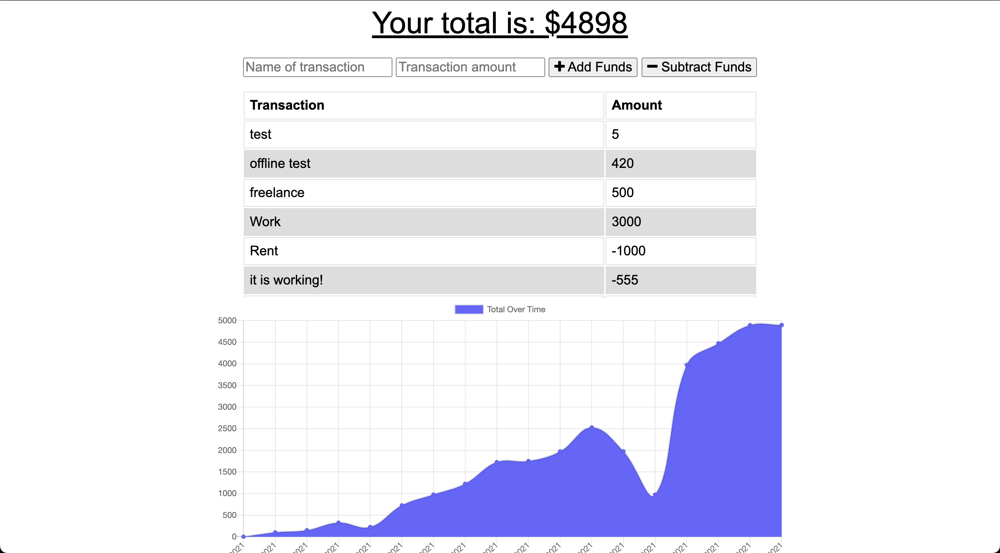

# Budget Tracker

    []()
## Description

Live Website: https://safe-beyond-93367.herokuapp.com/

This project stores the users transactions and displays them in a graph that is easy to read. This projcet utilizes a service worker and manifest.json files to create a Progressive Web Application. All of the funcitonality of this website can be used offline through the use of a service worker and indexedDB.

## Table of Contents:
* [Installation](#installation)
* [Usage](#usage)
* [Screenshot](#screenshot)
* [Credits](#credits)


## Installation 

This project requires node.js to be installed on your local machine. 

```
$ git clone git@github.com:ZachYarbrough/Budget-Tracker.git
$ cd Budget-Tracker
$ npm install
$ npm start
```
Visit localhost:3001 on any web browser.


## Usage 

This project should be used as a tool to track all transactions from your account.   

## Screenshot




## Credits

UT Austin full stack web development bootcamp